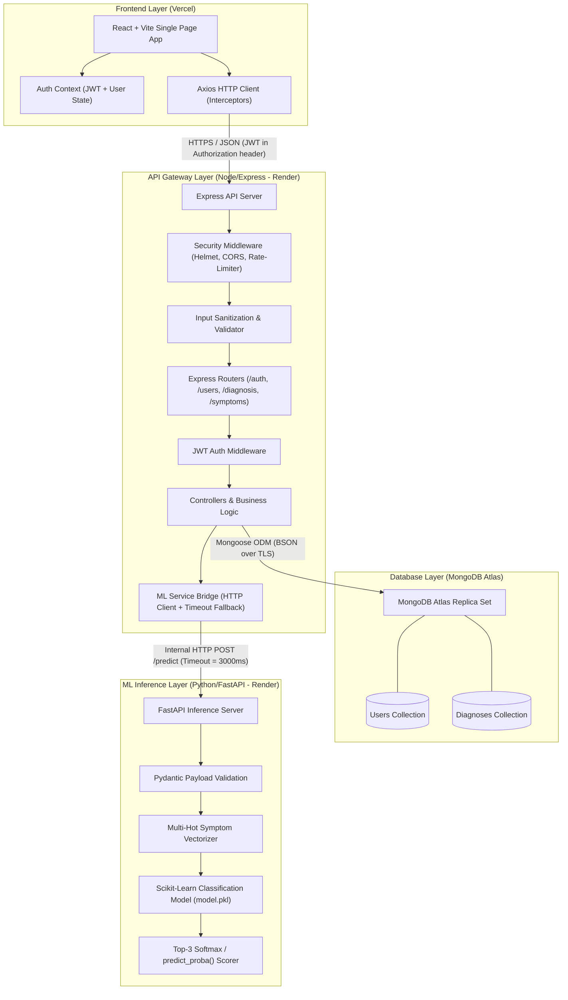
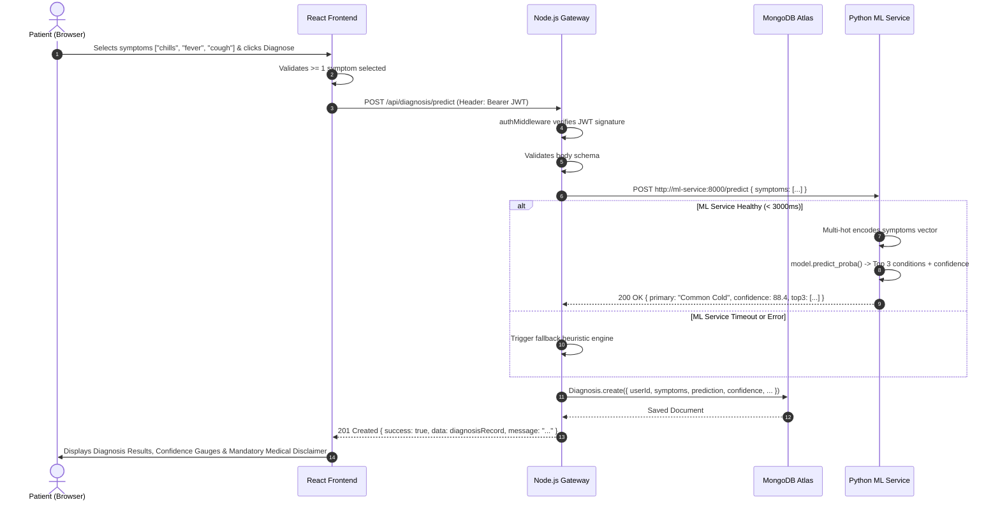
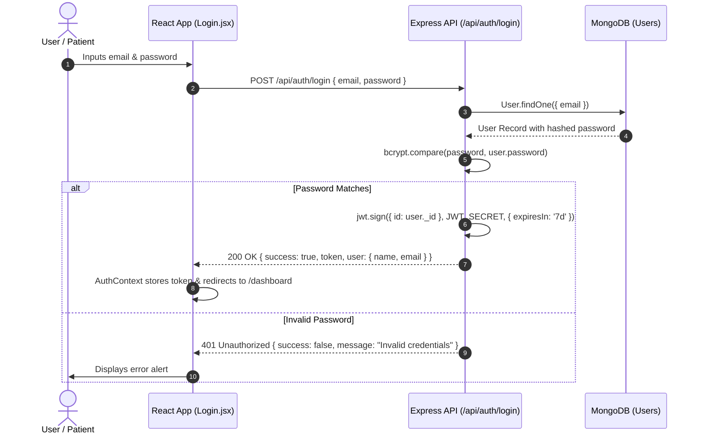

# Carepath / MedInsight — System Architecture

**Document Version:** 1.0  
**Status:** Approved Architecture Baseline  
**Project:** Online Health Diagnosis System  

---

## 1. Executive Architecture Overview

MedInsight is engineered as a **polyglot microservices system** featuring a 3-tier architecture with an asynchronous/internal ML inference microservice. It is designed to demonstrate production-grade full-stack patterns, robust API design, state-of-the-art security hygiene, and resilient machine learning integration.

### High-Level Topology Diagram

---

## 2. Architectural Decisions & Rationales (ADRs)

### ADR-01: Polyglot Microservices Pattern (Node.js API Gateway + Python ML Service)
- **Decision:** Separate the primary web API (Node.js/Express) from the Machine Learning inference engine (Python/FastAPI).
- **Rationale:**
  1. *Ecosystem Optimization:* Python is the industry standard for ML training, feature processing, and scikit-learn models. Node.js is optimal for concurrent I/O, JWT handling, and REST routing.
  2. *Gateway Security:* The frontend never accesses the Python ML service directly. The Node.js API acts as an authenticating gateway, preventing public access to unauthenticated ML endpoints.
  3. *Independent Scaling:* If inference traffic increases, the ML service can be scaled independently on Render without affecting auth or history retrieval.

### ADR-02: Stateless JWT Authentication with Client-Side Context
- **Decision:** Use JSON Web Tokens (JWT) signed with HS256 and stored client-side in memory/local storage with Axios interceptors.
- **Rationale:**
  1. Stateless verification eliminates session state lookup on MongoDB for every incoming request.
  2. Protected routes on Express (`/api/diagnosis/*`, `/api/users/*`) verify signatures in memory (`jwt.verify`).

### ADR-03: Multi-Hot Vector Encoding with Graceful Missing Feature Handling
- **Decision:** Symptoms are represented as binary flags (`[0, 1, 0, ...]`) mapped to a fixed dictionary of ~130 symptom features derived from public Kaggle medical datasets.
- **Rationale:**
  1. Avoids fragile and inaccurate NLP free-text parsing in the MVP.
  2. Guarantees deterministic input vectors for the Random Forest classifier.
  3. The FastAPI service strips unseen symptoms and safely fills zeroes for unselected symptoms.

### ADR-04: Graceful Degradation & Circuit-Breaker Fallback
- **Decision:** The Node API Gateway implements a 3-second timeout on the internal ML call.
- **Rationale:** If the ML service is cold-starting or temporarily unavailable, the API does **not** crash or return a 500. Instead, it returns a supportive heuristic fallback with severity-based self-care advice and prompts the user to consult a healthcare provider.

---

## 3. Detailed Component Breakdown

### 3.1 Frontend Architecture (`frontend/`)
- **Framework:** React 18+ bundled with Vite.
- **Styling:** Tailwind CSS / Modern CSS design tokens (responsive, high contrast, mobile-friendly).
- **State Management:**
  - `AuthContext`: Centralized authentication store holding current user token, user profile, login/logout methods, and loading flags.
  - Local state (`useState`, `useReducer`) for diagnosis forms, multi-select symptom pickers, and history pagination.
- **HTTP Client:** Centralized Axios instance (`src/services/api.js`) with:
  - *Request Interceptor:* Injects `Authorization: Bearer <token>` into all outbound requests.
  - *Response Interceptor:* Intercepts 401 Unauthorized errors to automatically purge expired tokens and redirect to `/login`.
- **UX & Medical Safety:**
  - Mandatory disclaimer banners on every diagnosis result: *"This is an AI-assisted supportive triage tool, not a medical diagnosis. In an emergency, contact local emergency services immediately."*

### 3.2 API Gateway & Backend Architecture (`backend/`)
- **Runtime:** Node.js (ES Modules, `type: module`).
- **Framework:** Express.js with layered architecture:
  - `routes/`: Explicit URL endpoint routing.
  - `middleware/`: Authentication (`authMiddleware.js`), rate limiting (`rateLimiter.js`), security headers (`helmet`), error handler (`errorHandler.js`).
  - `controllers/`: Request extraction, validation result checking, and orchestration.
  - `services/`: External ML HTTP bridge (`mlService.js`) and database query helpers.
  - `models/`: Mongoose schemas and indexes.
  - `config/`: Database connection (`db.js`) and constants (`constants.js`).

### 3.3 ML Microservice Architecture (`ml-service/`)
- **Framework:** FastAPI / Python 3.10+.
- **Model:** Scikit-learn **Random Forest Classifier** trained on Kaggle Disease Prediction dataset.
- **Artifacts:**
  - `model.pkl`: Serialized trained ensemble estimator.
  - `symptoms.json`: Ordered list of 130+ symptom feature names.
  - `diseases.json`: Class labels and human-readable condition summaries.
- **Endpoints:**
  - `GET /health`: Liveness probe.
  - `GET /symptoms`: Returns the complete master list of searchable symptoms.
  - `POST /predict`: Accepts JSON `{ symptoms: ["headache", "fever"] }`, returns top-3 predictions with confidence percentages.

### 3.4 Data Layer Architecture (`MongoDB Atlas`)
- **Collections:**
  1. `users`: Authentication records, bcrypt-hashed credentials, optional demographic data (age, gender).
  2. `diagnoses`: Historical check-in records containing symptoms array, predicted disease, confidence score, top-3 candidates, and timestamps.
- **Indexing Strategy:**
  - `users.email`: Unique index.
  - `diagnoses.userId + diagnoses.createdAt`: Compound descending index for instant paginated history lookups (`{ userId: 1, createdAt: -1 }`).

---

## 4. End-to-End Sequence Diagrams

### 4.1 Diagnosis Prediction Workflow

### 4.2 Authentication & Protected Route Workflow

---

## 5. Security & Threat Mitigation Architecture

| Threat / Vulnerability | Mitigation in Architecture |
|---|---|
| **Brute Force Login Attacks** | `express-rate-limit` configured on `/api/auth/*` (max 10 requests per 15 min window). |
| **Credential Exposure** | Passwords hashed with `bcryptjs` using 12 salt rounds; zero plaintext credentials stored or logged. |
| **Cross-Site Scripting (XSS)** | React JSX auto-escaping + `helmet` HTTP security headers (`Content-Security-Policy`, `X-XSS-Protection`). |
| **NoSQL Injection** | Mongoose strict schemas + input validation sanitizing query operators (`$gt`, `$ne`). |
| **Unauthorized Data Access** | All `/api/diagnosis/*` endpoints verify that `req.user._id` matches the document's `userId`. Users can never read another user's diagnosis records. |
| **Unauthenticated ML Access** | Python ML service runs on internal port / private network; only the Node.js API Gateway can reach it. |
| **Secret Leaks in Version Control** | Strict `.gitignore` rules + `.env.example` templates with empty dummy values. |

---

## 6. Resilience & Production Readiness

1. **Graceful Shutdown:** Express process traps `SIGINT` and `SIGTERM` to close database connections cleanly before exiting.
2. **Health Check Probes:**
   - Gateway: `GET /api/health` returns `{ status: "ok", service: "api-gateway", timestamp }`.
   - ML Service: `GET /health` returns `{ status: "ok", model_loaded: true, symptoms_count: 132 }`.
3. **Pagination Defense:** History endpoint `/api/diagnosis/history` enforces `page` and `limit` (max 50 items per page) to prevent unbounded memory allocation.
4. **Environment Integrity:** System checks for required environment variables (`MONGO_URI`, `JWT_SECRET`, `ML_SERVICE_URL`) on process initialization, failing fast if any are absent.
