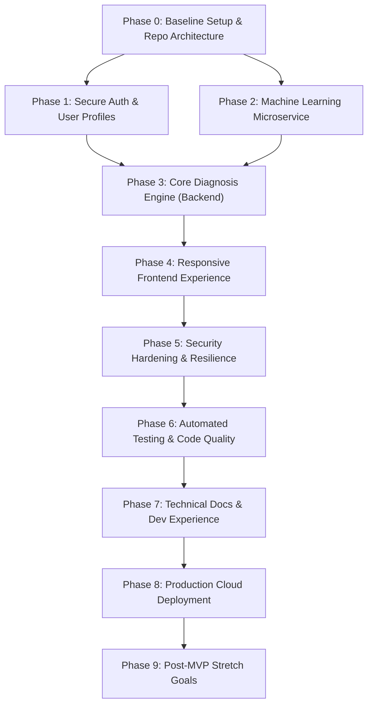

# Carepath / MedInsight — Master Project Goals & Phase Roadmap

**Project Name:** MedInsight (Carepath) — Online Health Diagnosis System  
**Document Version:** 1.0  
**Purpose:** Master tracking index and roadmap for all project development phases.

---

## 1. Project Phase Dependency & Lifecycle Flow

---

## 2. Phase Milestone Directory Index

Each phase contains its own dedicated `goal.md` containing full technical specifications, deliverables, testing criteria, and interview talking points:

| Phase | Title | Goal File | Status | Core Deliverable |
|---|---|---|---|---|
| **Phase 0** | Baseline Setup & Architecture | [`Docs/phases/phase-0-setup/goal.md`](file:///e:/Online-Health-Diagnosis-System/Docs/phases/phase-0-setup/goal.md) | Completed | Multi-service structure, Git discipline, health checks |
| **Phase 1** | Auth & User Profiles | [`Docs/phases/phase-1-auth/goal.md`](file:///e:/Online-Health-Diagnosis-System/Docs/phases/phase-1-auth/goal.md) | Completed | JWT authentication, bcrypt hashing, protected routes |
| **Phase 2** | Machine Learning Service | [`Docs/phases/phase-2-ml-service/goal.md`](file:///e:/Online-Health-Diagnosis-System/Docs/phases/phase-2-ml-service/goal.md) | Completed | Probabilistic classifier, Flask/FastAPI REST microservice |
| **Phase 3** | Diagnosis Backend Engine | [`Docs/phases/phase-3-diagnosis-backend/goal.md`](file:///e:/Online-Health-Diagnosis-System/Docs/phases/phase-3-diagnosis-backend/goal.md) | Next up | Node API Gateway bridge, Mongoose schemas, history API |
| **Phase 4** | Polished Frontend Experience | [`Docs/phases/phase-4-frontend-ui/goal.md`](file:///e:/Online-Health-Diagnosis-System/Docs/phases/phase-4-frontend-ui/goal.md) | Ready | Multi-select symptom selector, top-3 confidence meters, a11y |
| **Phase 5** | Security & Resilience Hardening | [`Docs/phases/phase-5-security-resilience/goal.md`](file:///e:/Online-Health-Diagnosis-System/Docs/phases/phase-5-security-resilience/goal.md) | Ready | Rate-limiting, Helmet, ML timeout circuit-breaker |
| **Phase 6** | Automated Testing & QA Suite | [`Docs/phases/phase-6-testing-qa/goal.md`](file:///e:/Online-Health-Diagnosis-System/Docs/phases/phase-6-testing-qa/goal.md) | Ready | Jest + Supertest integration tests, pytest ML tests |
| **Phase 7** | Developer Docs & Portfolios | [`Docs/phases/phase-7-documentation/goal.md`](file:///e:/Online-Health-Diagnosis-System/Docs/phases/phase-7-documentation/goal.md) | Ready | API specs, ML Report (confusion matrix), README demo |
| **Phase 8** | Production Cloud Deployment | [`Docs/phases/phase-8-deployment/goal.md`](file:///e:/Online-Health-Diagnosis-System/Docs/phases/phase-8-deployment/goal.md) | Ready | Vercel (FE), Render (BE & ML), MongoDB Atlas cluster |
| **Phase 9** | Post-MVP Stretch Goals | [`Docs/phases/phase-9-stretch-goals/goal.md`](file:///e:/Online-Health-Diagnosis-System/Docs/phases/phase-9-stretch-goals/goal.md) | Pending | Appointments, PDF export, Chatbot triage |

---

## 3. Global Definition of Done (DoD)

Before declaring the full project completed, all items in this checklist must be verified:
- [ ] All Functional Requirements (FR-1 through FR-13) implemented and verified.
- [ ] Unified response envelope `{ success, message, data, error }` adhered to by 100% of endpoints.
- [ ] Zero unhandled promise rejections or uncaught exceptions across all services.
- [ ] Zero console errors or warnings in browser developer tools during standard navigation.
- [ ] Mandatory medical disclaimer prominently displayed on all diagnosis-related pages.
- [ ] Deployed to public cloud infrastructure and fully accessible over HTTPS.
- [ ] All documentation files created and kept up to date with code changes.
